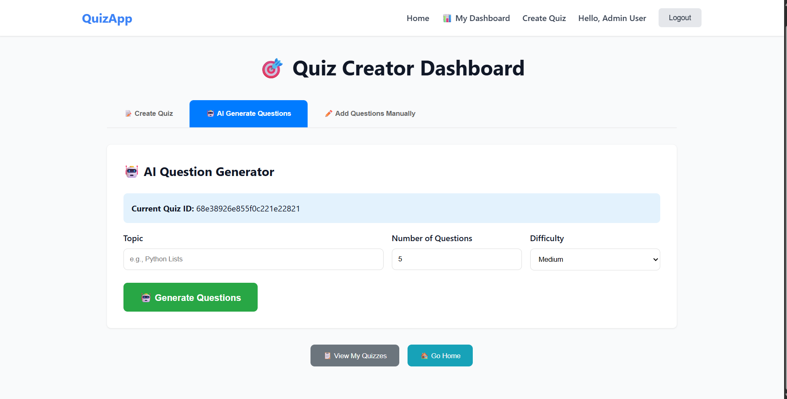
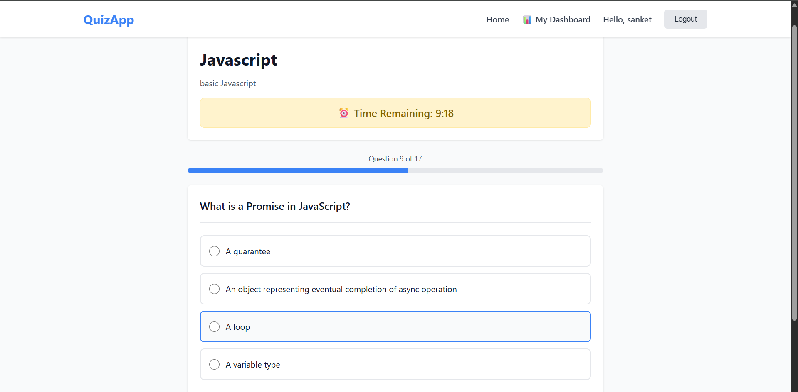
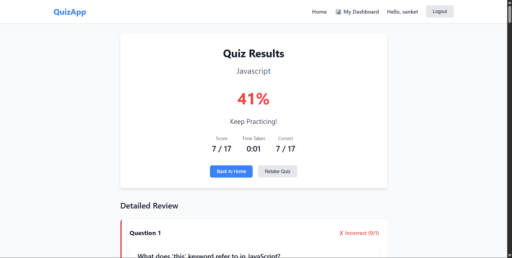
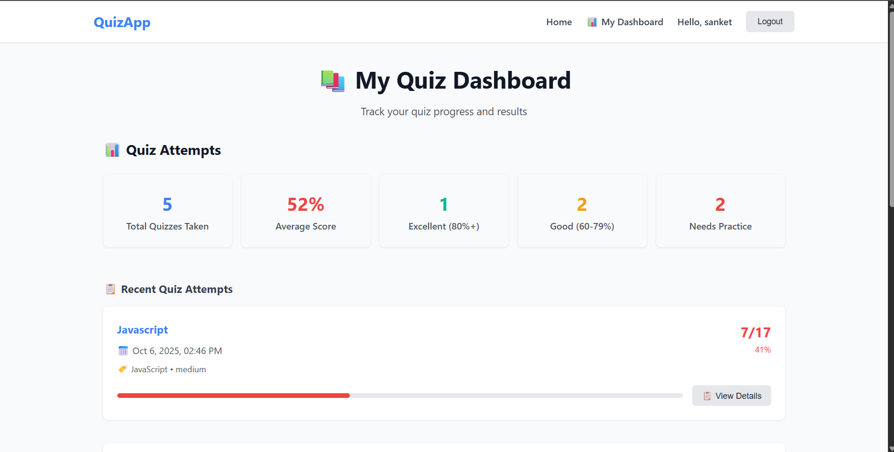
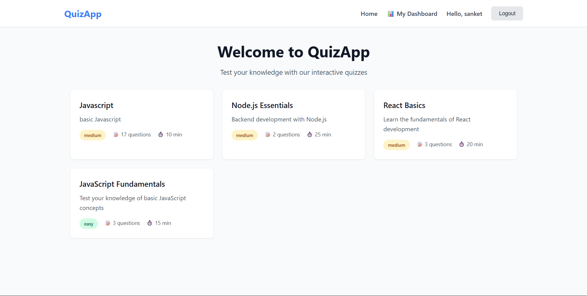

# Online Quiz Application

A comprehensive full-stack quiz application built with React and Node.js that enables users to take interactive quizzes and provides administrators with powerful tools to create and manage quiz content using AI-powered question generation.

## 🚀 Features

### User Features
- **User Authentication** - Secure registration and login system with JWT tokens
- **Interactive Quiz Taking** - Timed quizzes with real-time feedback
- **Personal Dashboard** - View quiz history, scores, and attempted quizzes
- **Real-time Results** - Instant scoring with detailed explanations
- **Responsive Design** - Works seamlessly on desktop and mobile devices

### Admin Features
- **Unified Quiz Creation Dashboard** - Tabbed interface for comprehensive quiz management
- **AI-Powered Question Generation** - Automatic question generation using Gemini AI with template fallback
- **Manual Question Builder** - Create custom questions with multiple choice options
- **Quiz Management** - Edit, update, and manage existing quizzes
- **Role-based Access Control** - Admin-only features with proper authentication

### Technical Features
- **Robust Error Handling** - Comprehensive error management with user-friendly messages
- **Template-based Fallback** - Ensures question generation works even without AI API keys
- **CORS Configuration** - Secure cross-origin resource sharing
- **Data Validation** - Input validation on both frontend and backend

## 📸 Application Screenshots

### Admin Dashboard - AI Question Generation

*Comprehensive admin panel with AI-powered question generation and quiz management tools*

### Interactive Quiz Interface

*Clean, intuitive quiz-taking experience with timer and progress tracking*

### Detailed Results & Analytics

*Comprehensive results page with detailed scoring and performance feedback*

### User Dashboard

*Personal dashboard showing quiz history, statistics, and performance analytics*

### Home Page - Available Quizzes

*Modern landing page displaying available quizzes with difficulty levels and topics*

## 🛠️ Tech Stack

### Frontend
- **React** - Modern React with hooks and context
- **React Router DOM** - Client-side routing and navigation
- **Vite** - Fast development build tool
- **Axios** - HTTP client with interceptors
- **CSS3** - Modern styling with responsive design

### Backend
- **Node.js** - JavaScript runtime environment
- **Express.js** - Web application framework
- **MongoDB** - NoSQL database with Mongoose ODM
- **JWT** - JSON Web Token authentication
- **Gemini AI API** - AI-powered question generation
- **Express Validator** - Request validation middleware
- **bcryptjs** - Password hashing

## 📋 Prerequisites

- **Node.js** 
- **MongoDB Atlas** 
- **Gemini API Key** 

## 🚀 Installation & Setup

### 1. Clone the Repository
```bash
git clone <repository-url>
cd online-quiz-app
```

### 2. Backend Setup
```bash
cd backend
npm install
```

Create a `.env` file in the backend directory:
```env
# Server Configuration
PORT=5001
NODE_ENV=development

# Database
MONGO_URI=your_mongodb_connection_string

# JWT Configuration
JWT_SECRET=your_jwt_secret_key
TOKEN_EXPIRES_IN=7d

# AI Configuration
GEMINI_API_KEY=your_gemini_api_key
# OPENAI_API_KEY=your_openai_api_key (optional)

# CORS Configuration
CORS_ORIGINS=http://localhost:5173,http://localhost:3000
```

### 3. Frontend Setup
```bash
cd ../frontend
npm install
```

Create a `.env` file in the frontend directory:
```env
VITE_API_BASE_URL=http://localhost:5001/api
```

### 4. Database Setup
The application will automatically connect to MongoDB. Ensure your MongoDB Atlas cluster is running or start your local MongoDB instance.

## 🏃‍♂️ Running the Application

### Development Mode

1. **Start the backend server:**
```bash
cd backend
npm run dev
```
Backend will run on `http://localhost:5001`

2. **Start the frontend development server:**
```bash
cd frontend
npm run dev
```
Frontend will run on `http://localhost:5173`

### Production Mode

1. **Build the frontend:**
```bash
cd frontend
npm run build
```

2. **Start the backend:**
```bash
cd backend
npm start
```

## 📚 Project Structure

```
online-quiz-app/
├── backend/
│   ├── src/
│   │   ├── config/         # Database and app configuration
│   │   ├── controllers/    # Route handlers and business logic
│   │   ├── middleware/     # Authentication and validation middleware
│   │   ├── models/         # MongoDB schemas (User, Quiz, Question, Attempt)
│   │   ├── routes/         # API route definitions
│   │   ├── services/       # AI services and business logic
│   │   ├── utils/          # Utility functions
│   │   └── server.js       # Application entry point
│   ├── .env               # Environment variables
│   └── package.json       # Backend dependencies
├── frontend/
│   ├── src/
│   │   ├── components/     # Reusable React components
│   │   ├── context/        # React context (AuthContext)
│   │   ├── pages/          # Main application pages
│   │   ├── services/       # API service layer
│   │   ├── App.jsx         # Main application component
│   │   └── main.jsx        # Application entry point
│   ├── .env               # Frontend environment variables
│   └── package.json       # Frontend dependencies
└── README.md              # Project documentation
```

## 🔌 API Endpoints

### Authentication Routes (`/api/auth`)
- `POST /register` - Register new user
- `POST /login` - User login
- `GET /me` - Get current user profile

### Quiz Routes (`/api/quizzes`)
- `GET /` - Get all available quizzes
- `GET /:id` - Get specific quiz details
- `POST /` - Create new quiz (admin only)
- `PUT /:id` - Update quiz (admin only)
- `DELETE /:id` - Delete quiz (admin only)
- `POST /:id/submit` - Submit quiz answers
- `POST /:id/questions` - Add questions to quiz (admin only)
- `GET /user/attempts` - Get user's quiz attempts

### Question Generation (`/api/generate`)
- `POST /questions` - Generate AI-powered questions (admin only)

## 🎯 Key Features Explained

### AI Question Generation
The application uses a sophisticated AI generation system:
1. **Primary**: Gemini AI API for intelligent question generation
2. **Fallback**: Template-based generation with predefined question banks
3. **Topics**: JavaScript, Python, General Knowledge
4. **Difficulties**: Easy, Medium, Hard

### Quiz Creation Workflow
1. **Create Quiz** - Set title, description, topic, difficulty, and time limit
2. **Generate Questions** - Use AI generation or manual creation
3. **Review & Edit** - Preview questions before saving
4. **Publish** - Make quiz available to users

### User Dashboard
- **My Quizzes** - View all attempted quizzes with scores
- **Quiz History** - Detailed attempt history with timestamps
- **Performance Tracking** - Score analytics and progress tracking

## 👨‍💻 Author

**Kunal Darekar** - Full Stack Developer

---

*Built with modern web technologies and best practices for scalable, maintainable code.*